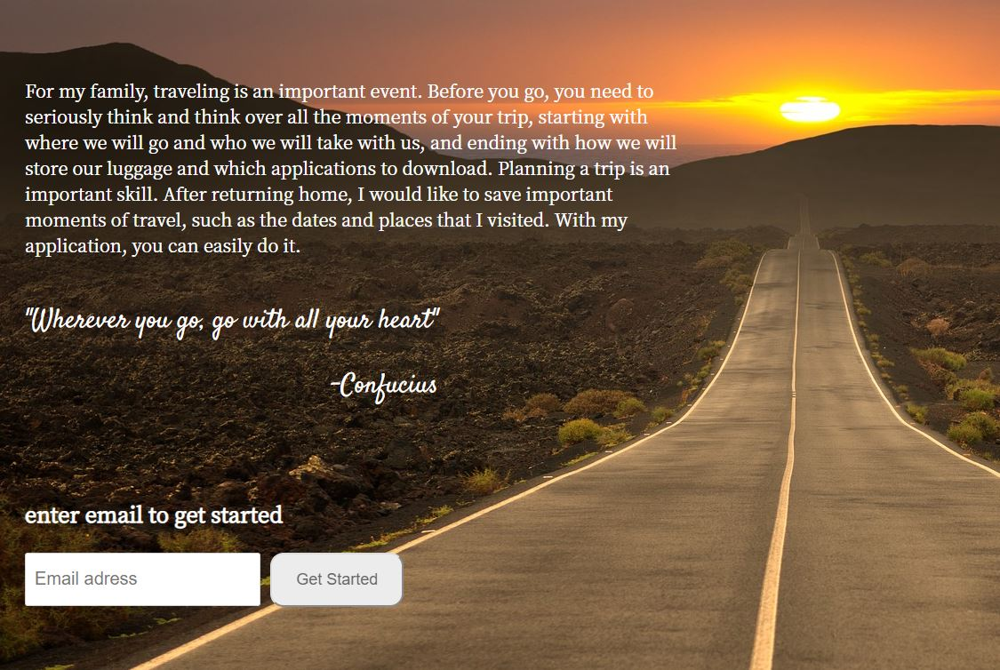
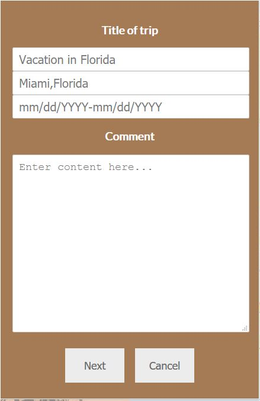
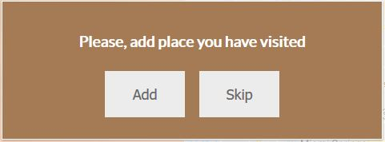
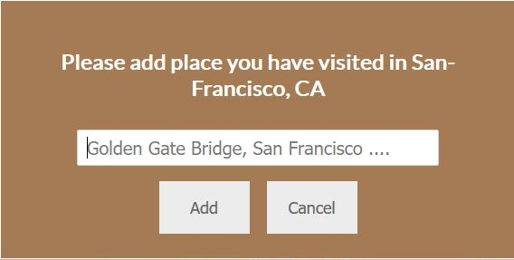
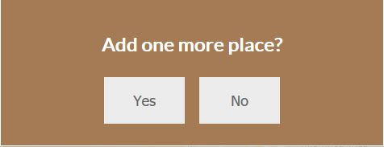
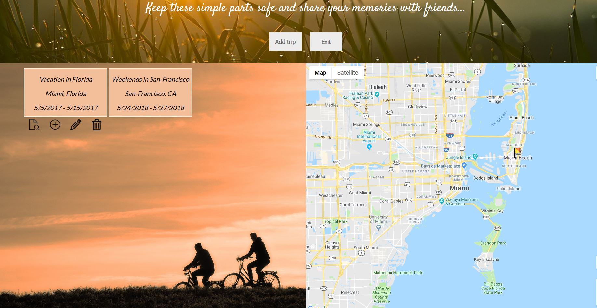

# Project Title

Trip Application (https://mighty-wildwood-62473.herokuapp.com/)

# Motivation

My application will help users to save important moments of travel, such as the dates and places that they have visited. With my application it is to do.

## Screenshots

Welcome screen:

Initial screen to add new trip:

Add new place you have visited:

Add one more place or skip it:

Main screen:

## Built With

* [HTML]
* [CSS]
* [JavaScript]
* [jQuery]
* [Node.js]
* [MongoDB]
* [Mongoose]

## Contributing

Node.js documentation
https://nodejs.org/en/docs/

MongoDB manual
https://docs.mongodb.com/manual/

Google Maps API documentation (https://developers.google.com/maps/documentation/javascript/tutorial)

## Authors

* **Sergey Ukhlivanov** - [ukhlivanov](https://github.com/ukhlivanov/)

## Acknowledgments

* Google Maps API
* Google Maps Geocode
* Node.js
* MongoDB
* Inspiration
